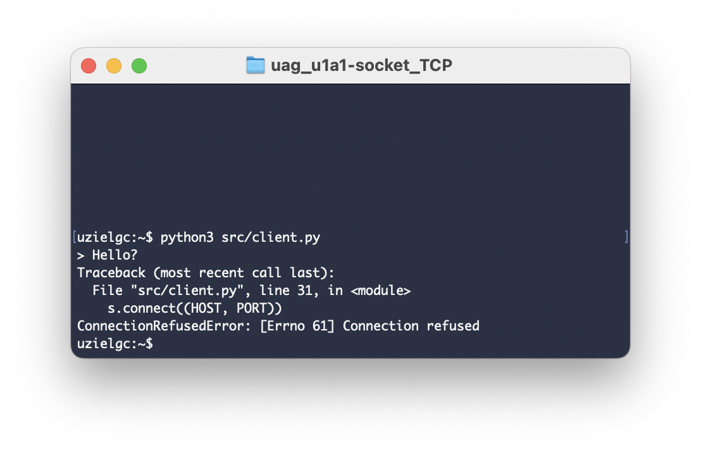
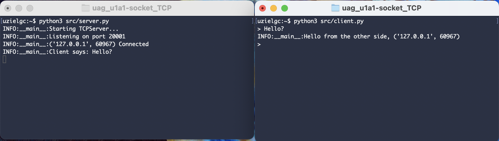
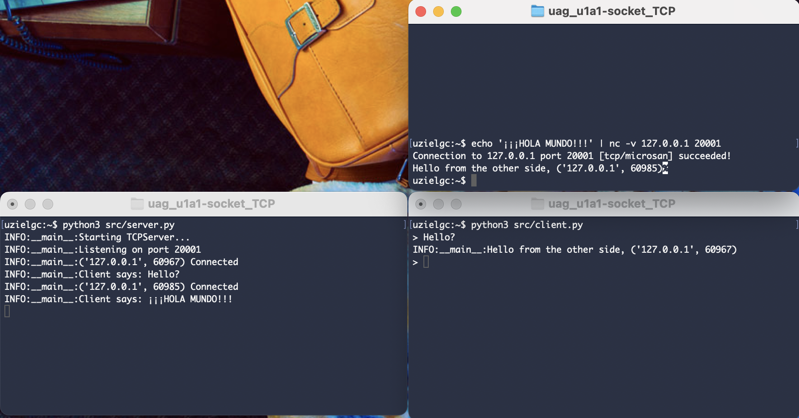

## U1 A1: Socket TCP

### Author: Eloy Uziel García Cisneros (eloy.garcia@edu.uag.mx)
#### Repo: https://github.com/uzielgc/uag_u1a1-socket_TCP

## Documentación

El código fuente se encuentra dentro de la carpeta [src](src).
La evidencia en imagenes se encuentra en la carpeta [images](images).
El código esta comentado en los puntos clave del proceso.

Al correr el cliente se entra en un ciclo que espera un texto del usuario, para enviar al servidor presione ENTER.

Cliente intenta conectar con servidor inexistente, conexión rechazada (orientado a conexión).



Cliente y servidor corriendo en procesos independientes.



Cliente (.py), servidor y un cliente adicional usando la utilería `ncat` (echo <msg> | nc -v <IP> <PUERTO>)
donde -v muestra log de la conexión establecida.



### Validación/Uso

Correr server:
    `python src/server.py`

Correr cliente:
    `python src/client.py`

### Output:

Terminal 1 client:
```
uzielgc:~$ python3 src/client.py 
> Hello?
Traceback (most recent call last):
  File "src/client.py", line 31, in <module>
    s.connect((HOST, PORT))
ConnectionRefusedError: [Errno 61] Connection refused
```

---> Despues de iniciar el servidor TCP.
```
uzielgc:~$ python3 src/client.py
> Hello?
INFO:__main__:Hello from the other side, ('127.0.0.1', 61134)
> 
```

Terminal 2 server:
```
uzielgc:~$ python3 src/server.py 
INFO:__main__:Starting TCPServer...
INFO:__main__:Listening on port 20001
INFO:__main__:('127.0.0.1', 61134) Connected
INFO:__main__:Client says: Hello?
INFO:__main__:('127.0.0.1', 61168) Connected
INFO:__main__:Client says: ¡¡¡HOLA MUNDO!!!

```

Terminal 3 nc:
```
uzielgc:~$ echo '¡¡¡HOLA MUNDO!!!' | nc -v 127.0.0.1 20001
Connection to 127.0.0.1 port 20001 [tcp/microsan] succeeded!
Hello from the other side, ('127.0.0.1', 61168)
uzielgc:~$ 
```
